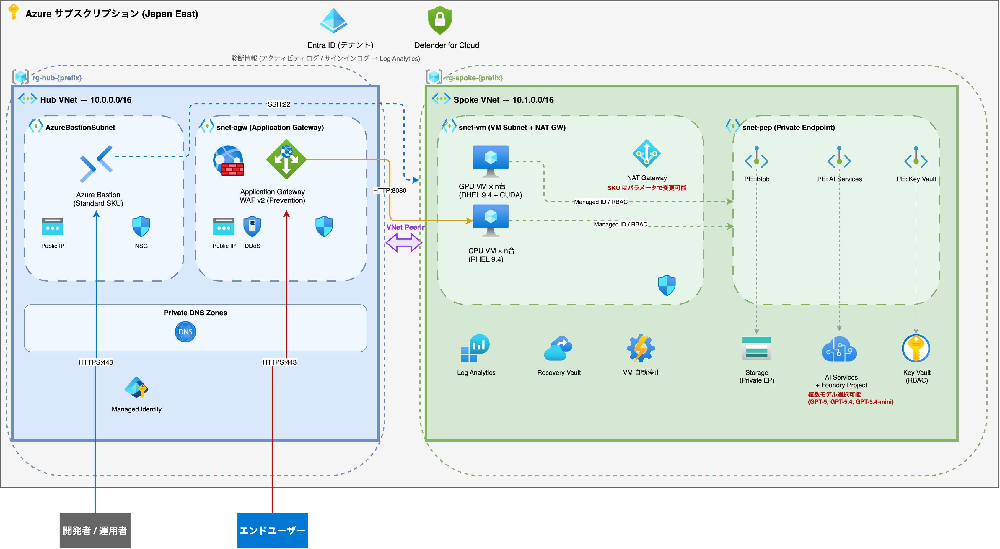
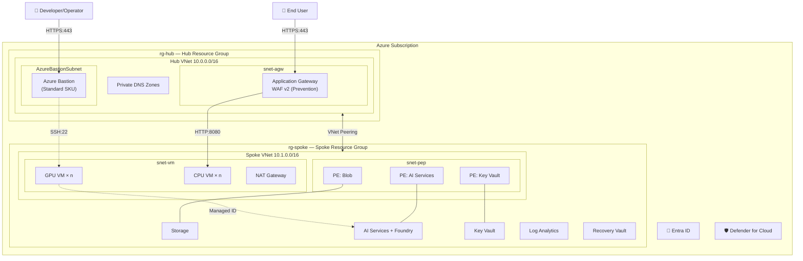

# Azure Hub-Spoke PoC Environment Template

[日本語](README.md)

## What is this?

A Bicep template that deploys an Azure **Hub-Spoke network** PoC environment with a single command.

- Built with [Azure Verified Modules (AVM)](https://azure.github.io/Azure-Verified-Modules/)
- Deploy with just `azd up`
- dev / prod environment separation
- CAF / WAF compliant enterprise security

## Configuration Patterns

Choose from 2 patterns depending on your use case:

| Pattern | Use Case | Application Gateway | External Access |
|---------|----------|---------------------|-----------------|
| **① With AGW** | Demo apps, API hosting | WAF v2 (Prevention) | Yes |
| **② Bastion Only** | Internal dev, closed testing | None | No |

Both patterns share Hub-Spoke network isolation, Bastion management access, and Private Endpoint data protection.

## Architecture

### Pattern ① — External access via Application Gateway



> Edit the diagram: open [images/architecture.drawio](images/architecture.drawio) in draw.io

<details>
<summary>Mermaid diagram (text-based)</summary>



</details>

## Quick Start

### Prerequisites

- [Azure CLI](https://learn.microsoft.com/cli/azure/install-azure-cli) v2.72.0+
- [Azure Developer CLI (azd)](https://learn.microsoft.com/azure/developer/azure-developer-cli/install-azd) v1.10.0+
- Azure Subscription (**Owner** role)

### Deploy in 3 Steps

```bash
# 1. Clone
git clone https://github.com/<your-org>/azure-poc-hub-spoke.git
cd azure-poc-hub-spoke

# 2. Configure
azd init
azd env set AZURE_PREFIX "myenv01"
azd env set AZURE_LOCATION "japaneast"
azd env set OPERATOR_ALLOW_IP "203.0.113.0/24"

# 3. Deploy
azd up
```

`azd up` automatically executes:
1. SSH key generation, resource provider registration
2. Bicep template deployment
3. VNet Flow Log creation

### Tear Down

```bash
azd down
```

## Deployed Resources

### Hub Resource Group
- VNet (Bastion Subnet, AGW Subnet)
- Azure Bastion (Standard SKU)
- Application Gateway + WAF v2 — optional
- Private DNS Zones (Blob, CognitiveServices, Key Vault)
- VNet Peering

### Spoke Resource Group
- VNet (VM Subnet, PE Subnet)
- CPU VM / GPU VM (RHEL 9.4, SSH key auth)
- AI Services + Foundry Project — optional
- Key Vault (RBAC)
- Storage Account (Private Endpoint)
- Log Analytics Workspace
- NAT Gateway
- Recovery Services Vault — optional

### Subscription Level
- Microsoft Defender for Cloud — optional
- Activity / Entra ID log collection

## Parameters

### Basic

| Environment Variable | Description | Default |
|---------------------|-------------|---------|
| `AZURE_PREFIX` | Resource naming prefix | *(required)* |
| `AZURE_LOCATION` | Region | `japaneast` |

### VM

| Environment Variable | Description | Default |
|---------------------|-------------|---------|
| `VM_PATTERN` | 1: CPU / 2: GPU / 3: Both | `3` |
| `CPUVM_NUMBER` / `GPUVM_NUMBER` | VM count | `1` / `1` |
| `CPUVM_SKU` / `GPUVM_SKU` | VM SKU | `Standard_D8as_v5` / `Standard_NC24ads_A100_v4` |

### AI Foundry

| Environment Variable | Description | Default |
|---------------------|-------------|---------|
| `ENABLE_FOUNDRY` | Enable AI Foundry | `true` |
| `FOUNDRY_LOCATION` | AI Services region | `eastus2` |

### Network

| Environment Variable | Description | Default |
|---------------------|-------------|---------|
| `HUB_ADDRESS_PREFIX` | Hub VNet CIDR | `10.0.0.0/16` |
| `SPOKE_ADDRESS_PREFIX` | Spoke VNet CIDR | `10.1.0.0/16` |
| `OPERATOR_ALLOW_IP` | Operator IP | `203.0.113.0/24` |
| `ENABLE_APP_GATEWAY` | Enable AGW | `false` |

### Security & Monitoring

| Environment Variable | Description | Default |
|---------------------|-------------|---------|
| `ENABLE_DEFENDER` | Defender for Cloud | `false` |
| `ENABLE_BACKUP` | Azure Backup | `true` |
| `ENABLE_WORM` | Storage immutability | `false` |
| `ENABLE_VM_AUTO_STOP` | VM auto stop | `true` |

> All parameters: [docs/deploy-guide.md](docs/deploy-guide.md)

## Security

| Check | Status |
|---|---|
| WAF Prevention (DRS 2.1 + BotManager) | ✅ |
| NSG per subnet (whitelist) | ✅ |
| Private Endpoints for all data services | ✅ |
| Key Vault RBAC + Purge Protection + SoftDelete 90d | ✅ |
| Storage TLS 1.2 + HTTPS Only + No shared keys + Double encryption | ✅ |
| VM SSH Key Only + Trusted Launch + Secure Boot | ✅ |
| Bastion session recording + copy-paste disabled | ✅ |
| NVIDIA driver SHA256 checksum verification | ✅ |
| CI/CD OIDC + Azure ID double masking | ✅ |
| CanNotDelete locks on critical resources | ✅ |
| 90-day log retention | ✅ |

## WAF 5 Pillars

| Pillar | Implementation |
|---|---|
| **Reliability** | Recovery Vault (Geo+CRR), WORM, Soft Delete |
| **Security** | WAF, NSG, PE, RBAC, SSH Key Only |
| **Cost Optimization** | dev/prod separation, VM auto stop |
| **Operational Excellence** | IaC (Bicep+AVM), CI/CD (OIDC), Log Analytics |
| **Performance** | GPU VM (CUDA), NAT GW, AGW v2 |

## CI/CD (DevSecOps)

GitHub Actions pipelines with Shift-Left security — catching issues at PR stage.

### Pipeline Overview

```
PR ──→ CI (ci.yml) ──→ Merge ──→ CD (cd.yml)
         │                         │
         ├─ 🔍 Bicep Lint          ├─ 🚀 dev auto-deploy + Smoke Test
         ├─ 🛡️ PSRule (WAF/CAF)   └─ 🚀 prod manual deploy
         ├─ 🔐 Gitleaks                 ├─ What-If preview
         └─ 📋 What-If → PR comment    ├─ Approval gate ⏸️
                                        └─ Smoke Test
```

### Workflow Details

| File | Trigger | Job | Description |
|---|---|---|---|
| `ci.yml` | PR → main | 🔍 Lint | Bicep syntax + SARIF report |
| | | 🛡️ Security | PSRule for Azure (WAF/CAF compliance) |
| | | 🔐 Secrets | Gitleaks (secret leak detection) |
| | | 📋 What-If | Change preview as PR comment |
| `cd.yml` | main push | 🚀 dev | Auto deploy + Smoke Test |
| | manual | 🚀 prod | Approval → deploy + Smoke Test |

### Security Measures

| Measure | Description |
|---|---|
| **OIDC Auth** | No long-lived credentials. Federated Identity for Azure login |
| **ID Double Masking** | `::add-mask::` + `sed` to hide Sub/Tenant/Client IDs |
| **PSRule** | Detect WAF/CAF violations at PR stage |
| **Gitleaks** | Detect passwords, API keys in code |
| **Approval Gate** | prod deploy requires GitHub Environment reviewer approval |
| **Concurrency** | Prevents parallel deploys to same environment |

## Directory Structure

```
.
├── azure.yaml                    # azd config
├── infra/
│   ├── main.bicep                # Entry point
│   ├── modules/
│   │   ├── hub.bicep             # Hub (VNet, Bastion, AGW, DNS) - AVM
│   │   ├── spoke.bicep           # Spoke (VM, KV, Storage, AI) - AVM
│   │   ├── peering.bicep         # VNet Peering
│   │   └── cloud-init/           # VM init (cpu-vm.yaml, gpu-vm.yaml)
│   └── parameters/
│       ├── dev.bicepparam        # dev environment
│       └── prod.bicepparam       # prod environment
├── scripts/                      # azd hooks
├── docs/                         # Operations guides
│   └── GUIDE.md                  # Document index
└── .github/workflows/            # CI/CD (DevSecOps)
    ├── ci.yml                    # PR: Lint + PSRule + Gitleaks + What-If
    └── cd.yml                    # Deploy: dev (auto) / prod (approval)
```

## Naming Conventions

[CAF Resource Abbreviations](https://learn.microsoft.com/azure/cloud-adoption-framework/ready/azure-best-practices/resource-abbreviations)

| Resource | Pattern | Example |
|---|---|---|
| Resource Group | `rg-{role}-{prefix}-{location}-001` | `rg-hub-dev0001-japaneast-001` |
| VNet | `vnet-{role}-{prefix}-{location}-001` | `vnet-spoke-dev0001-japaneast-001` |
| Bastion | `bas-{prefix}-{location}-001` | `bas-dev0001-japaneast-001` |
| App Gateway | `agw-{prefix}-{location}-001` | `agw-dev0001-japaneast-001` |
| Key Vault | `kv-{prefix}-{unique}` | `kv-dev0001-a1b2c3` |
| AI Services | `ais-{prefix}-{location}-001` | `ais-dev0001-japaneast-001` |

## Documentation

| Document | Content |
|---|---|
| [Deploy Guide](docs/deploy-guide.md) | Environment setup with azd / CLI |
| [Teardown Guide](docs/teardown-guide.md) | Safe environment deletion |
| [SSL Certificate Issuance](docs/ssl-certificate-issuance.md) | Self-signed / Let's Encrypt / CA |
| [VM Remote Access](docs/vm-remote-access.md) | SSH / Jupyter / marimo |
| [Log Collection](docs/log-collection-reference.md) | Collectable log types |
| [Cost Estimate](docs/cost-estimate.md) | Monthly cost for dev / prod |

> All docs: [docs/GUIDE.md](docs/GUIDE.md)

## License

MIT License
