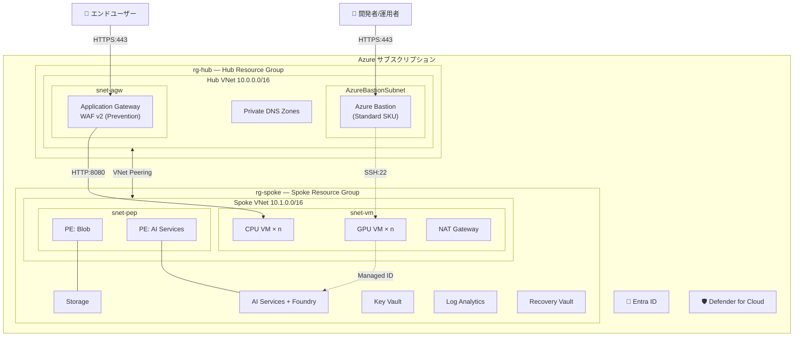

# Azure Hub-Spoke PoC 環境テンプレート

[](https://portal.azure.com/#create/Microsoft.Template/uri/https%3A%2F%2Fraw.githubusercontent.com%2Fnaoki1213mj%2Fazure-simple-poc-bicep%2Fmaster%2Finfra%2Fmain.json)
[](LICENSE)
[](https://learn.microsoft.com/azure/azure-resource-manager/bicep/)
[](https://azure.github.io/Azure-Verified-Modules/)

[English](README.en.md)

## これは何？

Azure 上に **Hub-Spoke ネットワーク構成** の PoC 環境を、コマンド一発でデプロイできる Bicep テンプレートです。

- [Azure Verified Modules (AVM)](https://azure.github.io/Azure-Verified-Modules/) で構築
- `azd up` だけで環境構築が完了
- dev / prod の環境分離に対応
- CAF / WAF 準拠のエンタープライズセキュリティ

## Azure Verified Modules (AVM) とは

本テンプレートは [Azure Verified Modules](https://azure.github.io/Azure-Verified-Modules/) を全面採用しています。AVM は Microsoft が公式にメンテナンスする Bicep モジュール集で、以下のメリットがあります:

- **品質保証**: Microsoft の CI/CD でテスト済み。セキュリティ・命名規則・診断設定が組み込み
- **簡潔なコード**: RBAC・Private Endpoint・診断設定・ロックがパラメータ一つで設定可能
- **バージョン管理**: `br/public:avm/res/...:<version>` で明示的にピン留め
- **最新 API**: モジュール側が API バージョンを管理するため、手動更新が不要

```bicep
// 例: AVM で Key Vault を定義（RBAC + パージ保護 + ロック + 診断設定を1リソースで）
module keyVault 'br/public:avm/res/key-vault/vault:0.11.0' = {
  params: {
    name: 'kv-example'
    enableRbacAuthorization: true
    enablePurgeProtection: true
    lock: { kind: 'CanNotDelete' }
    diagnosticSettings: [{ workspaceResourceId: logAnalyticsId }]
  }
}
```

## 構成パターン

用途に応じて 2 つのパターンを選択できます。

| パターン | 用途 | Application Gateway | 外部公開 |
|----------|------|---------------------|---------|
| **① AGW あり** | デモアプリの公開、API 提供 | WAF v2 (Prevention) | あり |
| **② Bastion のみ** | 社内開発、閉じた検証 | なし | なし |

両パターンとも Hub-Spoke ネットワーク分離、Bastion 経由の管理アクセス、Private Endpoint によるデータ保護は共通です。

## アーキテクチャ

### パターン① — AGW による外部公開


> 構成図の編集: [images/architecture.drawio](images/architecture.drawio) を draw.io で開く

<details>
<summary>Mermaid 図（テキストベース）</summary>



</details>

## クイックスタート

### 前提条件

- [Azure CLI](https://learn.microsoft.com/cli/azure/install-azure-cli) v2.80.0+
- [Azure Developer CLI (azd)](https://learn.microsoft.com/azure/developer/azure-developer-cli/install-azd) v1.16.0+
- Azure サブスクリプション（**所有者**ロール）

### 3 ステップでデプロイ

```bash
# 1. クローン
git clone https://github.com/<your-org>/azure-poc-hub-spoke.git
cd azure-poc-hub-spoke

# 2. 環境設定
azd init
azd env set AZURE_PREFIX "myenv01"
azd env set AZURE_LOCATION "japaneast"
azd env set OPERATOR_ALLOW_IP "203.0.113.0/24"

# 3. デプロイ
azd up
```

`azd up` で以下が自動実行されます:
1. SSH 鍵生成、リソースプロバイダー登録
2. Bicep テンプレートのデプロイ
3. VNet Flow Log 作成

### 環境の削除

```bash
azd down
```

## デプロイされるリソース

### Hub リソースグループ
- VNet (Bastion Subnet, AGW Subnet)
- Azure Bastion (Standard SKU)
- Application Gateway + WAF v2 ※オプション
- Private DNS Zones (Blob, CognitiveServices, Key Vault)
- VNet Peering

### Spoke リソースグループ
- VNet (VM Subnet, PE Subnet)
- CPU VM / GPU VM (RHEL 9.4, SSH 鍵認証)
- AI Services + Foundry Project ※オプション
- Key Vault (RBAC)
- Storage Account (Private Endpoint)
- Log Analytics Workspace
- NAT Gateway
- Recovery Services Vault ※オプション

### サブスクリプションレベル
- Microsoft Defender for Cloud ※オプション
- アクティビティログ → Log Analytics 転送

## パラメータ一覧

### 基本設定

| 環境変数 | 説明 | デフォルト |
|----------|------|-----------|
| `AZURE_PREFIX` | リソース命名プレフィックス | *(必須)* |
| `AZURE_LOCATION` | リージョン | `japaneast` |

### VM

| 環境変数 | 説明 | デフォルト |
|----------|------|-----------|
| `VM_PATTERN` | 1:CPU / 2:GPU / 3:両方 | `3` |
| `CPUVM_NUMBER` / `GPUVM_NUMBER` | VM 台数 | `1` / `1` |
| `CPUVM_SKU` / `GPUVM_SKU` | VM SKU | `Standard_D8as_v5` / `Standard_NC24ads_A100_v4` |
| `CPUVM_DATADISK_SIZE` / `GPUVM_DATADISK_SIZE` | データディスク (GB) | `512` / `1536` |
| `VM_USER` | VM 管理者ユーザー名 | `azureuser` |

### Microsoft Foundry

| 環境変数 | 説明 | デフォルト |
|----------|------|-----------|
| `ENABLE_FOUNDRY` | Microsoft Foundry 有効 | `true` |
| `FOUNDRY_LOCATION` | AI Services リージョン | `eastus2` |

### ネットワーク

| 環境変数 | 説明 | デフォルト |
|----------|------|-----------|
| `HUB_ADDRESS_PREFIX` | Hub VNet CIDR | `10.0.0.0/16` |
| `SPOKE_ADDRESS_PREFIX` | Spoke VNet CIDR | `10.1.0.0/16` |
| `OPERATOR_ALLOW_IP` | 運用者 IP | `203.0.113.0/24` |
| `CUSTOMER_ALLOW_IP` | エンドユーザー IP | `192.0.2.0/24` |
| `ENABLE_APP_GATEWAY` | AGW 有効 | `false` |
| `DOMAIN` | ドメイン名（AGW 使用時） | `.example.com` |

### セキュリティ・監視

| 環境変数 | 説明 | デフォルト |
|----------|------|-----------|
| `ENABLE_DEFENDER` | Defender for Cloud | `false` |
| `ENABLE_BACKUP` | Azure Backup | `true` |
| `ENABLE_WORM` | ストレージ不変性ポリシー | `false` |
| `WORM_RETENTION_DAYS` | WORM 保持期間（日） | `7` |
| `ENABLE_VM_AUTO_STOP` | VM 自動停止 | `true` |
| `VM_STOP_TIME` | VM 停止時刻 (HHmm) | `1800` |
| `ENABLE_VM_MONITORING` | VM 性能監視 (AMA + アラート) | `false` |
| `ALERT_EMAIL` | アラート通知先メール | `ops@example.com` |

> 全パラメータは [docs/deploy-guide.md](docs/deploy-guide.md) を参照

## セキュリティ

| チェック項目 | 状態 |
|---|---|
| WAF Prevention (DRS 2.1 + BotManager) | ✅ |
| NSG per subnet (ホワイトリスト方式) | ✅ |
| Storage / AI Services に Private Endpoint | ✅ |
| Key Vault RBAC + Purge Protection + SoftDelete 90日 + IP ACL | ✅ |
| Storage TLS 1.2 + HTTPS Only + 共有キー無効 + 二重暗号化 | ✅ |
| VM SSH Key Only + Trusted Launch + Secure Boot | ✅ |
| Bastion Standard SKU (IP Connect + ファイルコピー有効) | ✅ |
| NVIDIA ドライバ SHA256 チェックサム検証 | ✅ |
| CI/CD OIDC 認証 + Azure ID 二重マスク | ✅ |
| 重要リソースに CanNotDelete ロック | ✅ |
| ログ保持 90 日 | ✅ |

## WAF 5 つの柱

| 柱 | 対応 |
|---|---|
| **信頼性** | Recovery Vault (Geo冗長+CRR), WORM, ソフトデリート |
| **セキュリティ** | WAF, NSG, PE, RBAC, SSH Key Only |
| **コスト最適化** | dev/prod 環境分離, VM 自動停止 |
| **運用** | IaC (Bicep+AVM), CI/CD (OIDC), Log Analytics |
| **パフォーマンス** | GPU VM (CUDA), NAT GW, AGW v2 |

## CI/CD (DevSecOps)

GitHub Actions による自動化パイプラインです。Shift-Left の原則で、PR 段階からセキュリティ検証を実施します。

### パイプライン構成

```
PR 作成 ──→ CI (ci.yml) ──→ マージ ──→ CD (cd.yml)
              │                            │
              ├─ 🔍 Bicep Lint             ├─ 🚀 dev 自動デプロイ
              ├─ 🛡️ PSRule (WAF/CAF)       │     └─ Smoke Test
              ├─ 🔐 Gitleaks              └─ 🚀 prod 手動デプロイ
              └─ 📋 What-If → PR コメント        ├─ What-If プレビュー
                                                 ├─ 承認ゲート ⏸️
                                                 └─ Smoke Test
```

### ワークフロー詳細

| ファイル | トリガー | ジョブ | 説明 |
|---|---|---|---|
| `ci.yml` | PR → main | 🔍 Lint | Bicep 構文チェック + SARIF レポート |
| | | 🛡️ Security | PSRule for Azure（WAF/CAF ルール違反を検出） |
| | | 🔐 Secrets | Gitleaks（コード内の機密情報漏洩を検出） |
| | | 📋 What-If | 変更プレビューを PR にコメント |
| `cd.yml` | main push | 🚀 dev | dev 環境へ自動デプロイ + Smoke Test |
| | 手動 | 📋 What-If (prod) | prod 変更プレビュー |
| | | 🚀 prod | 承認後に prod デプロイ + Smoke Test |

### セキュリティ対策

| 対策 | 説明 |
|---|---|
| **OIDC 認証** | 長期クレデンシャルなし。Federated Identity で Azure にログイン |
| **ID 二重マスク** | `::add-mask::` + `sed` で Subscription/Tenant/Client ID を隠蔽 |
| **PSRule** | WAF/CAF ベストプラクティスに違反する設定を PR 段階で検出 |
| **Gitleaks** | パスワード・API キー・証明書のコード内埋め込みを検出 |
| **承認ゲート** | prod デプロイには GitHub Environment の承認者による承認が必須 |
| **Concurrency** | 同一環境への並行デプロイを防止 |

### セットアップ

1. **OIDC 用の Entra ID アプリケーション登録**
   ```bash
   az ad app create --display-name "github-actions-oidc"
   az ad sp create --id <app-id>
   az ad app federated-credential create --id <app-id> --parameters @- <<EOF
   {
     "name": "github-main",
     "issuer": "https://token.actions.githubusercontent.com",
     "subject": "repo:<owner>/<repo>:ref:refs/heads/main",
     "audiences": ["api://AzureADTokenExchange"]
   }
   EOF
   ```

2. **GitHub Secrets の設定**

   | Secret | 値 |
   |---|---|
   | `AZURE_CLIENT_ID` | Entra ID アプリケーション ID |
   | `AZURE_TENANT_ID` | テナント ID |
   | `AZURE_SUBSCRIPTION_ID` | サブスクリプション ID |

3. **GitHub Environments の設定**
   - `dev`: 保護ルールなし（自動デプロイ）
   - `prod`: Required reviewers を設定（承認必須）

## ディレクトリ構成

```
.
├── azure.yaml                    # azd 設定
├── infra/
│   ├── main.bicep                # エントリポイント
│   ├── main.bicepparam           # azd パラメータ（環境変数連携）
│   ├── modules/
│   │   ├── hub.bicep             # Hub (VNet, Bastion, AGW, DNS) - AVM
│   │   ├── spoke.bicep           # Spoke (VM, KV, Storage, AI) - AVM
│   │   ├── peering.bicep         # VNet Peering
│   │   └── cloud-init/           # VM 初期化 (cpu-vm.yaml, gpu-vm.yaml)
│   └── parameters/
│       ├── dev.bicepparam        # dev 環境
│       └── prod.bicepparam       # prod 環境
├── scripts/
│   ├── preprovision.sh           # 事前処理
│   └── postprovision.sh          # 後処理
├── docs/                         # 運用ドキュメント
│   └── GUIDE.md                  # ドキュメント一覧
├── images/
│   └── architecture.drawio       # 構成図（draw.io）
└── .github/workflows/            # CI/CD (DevSecOps)
    ├── ci.yml                    # PR: Lint + PSRule + Gitleaks + What-If
    └── cd.yml                    # Deploy: dev (auto) / prod (approval)
```

## 命名規則

[CAF Resource Abbreviations](https://learn.microsoft.com/azure/cloud-adoption-framework/ready/azure-best-practices/resource-abbreviations) 準拠

| リソース | パターン | 例 |
|---|---|---|
| Resource Group | `rg-{role}-{prefix}-{location}-001` | `rg-hub-dev0001-japaneast-001` |
| VNet | `vnet-{role}-{prefix}-{location}-001` | `vnet-spoke-dev0001-japaneast-001` |
| Bastion | `bas-{prefix}-{location}-001` | `bas-dev0001-japaneast-001` |
| App Gateway | `agw-{prefix}-{location}-001` | `agw-dev0001-japaneast-001` |
| Key Vault | `kv-{prefix}-{unique}` | `kv-dev0001-a1b2c3` |
| Storage | `st{prefix}{unique}` | `stdev0001x7y8z9` |
| AI Services | `ais-{prefix}-{location}-001` | `ais-dev0001-japaneast-001` |
| VM | `vm-{type}-{prefix}-{location}-{nnn}` | `vm-cpu-dev0001-japaneast-001` |
| NAT Gateway | `nat-{prefix}-{location}-001` | `nat-dev0001-japaneast-001` |
| NSG | `nsg-{role}-{prefix}-{location}-001` | `nsg-vm-dev0001-japaneast-001` |

## ドキュメント

| ドキュメント | 内容 |
|---|---|
| [デプロイ手順書](docs/deploy-guide.md) | azd / Azure CLI での環境構築 |
| [環境削除手順書](docs/teardown-guide.md) | 安全な環境削除 |
| [SSL 証明書発行](docs/ssl-certificate-issuance.md) | 自己署名 / Let's Encrypt / 商用 CA |
| [SSL 証明書更新](docs/ssl-certificate-renewal.md) | Key Vault + AGW の証明書更新 |
| [VM リモート接続](docs/vm-remote-access.md) | SSH / Jupyter / marimo |
| [ログ収集一覧](docs/log-collection-reference.md) | 収集可能なログの種類 |
| [コスト見積もり](docs/cost-estimate.md) | dev / prod 月額概算 |

> 全ドキュメント一覧: [docs/GUIDE.md](docs/GUIDE.md)

## ライセンス

MIT License
