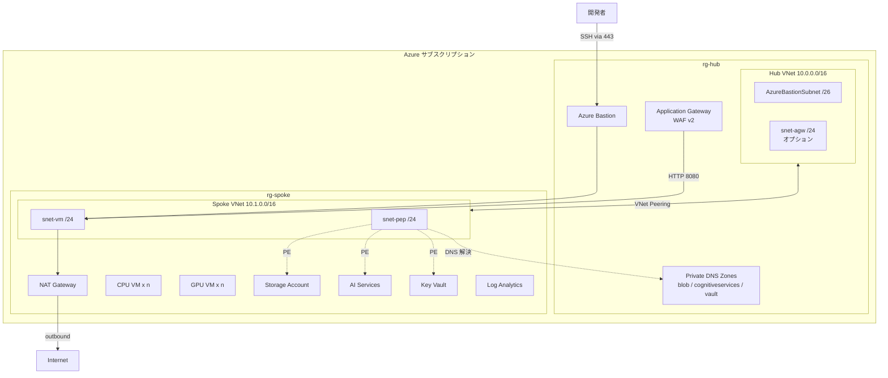
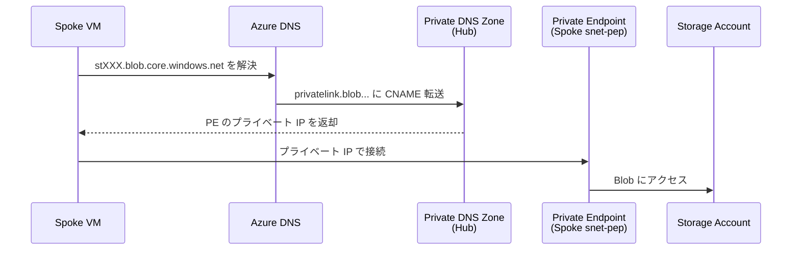

## はじめに

こんにちは。Azure のネットワーク構成を Bicep で書く練習がしたくて、Hub-Spoke の PoC 環境テンプレートを作りました。

ちょうど Azure Verified Modules（AVM）の存在を知り「リソースを直書きするよりモジュール経由のほうが楽なのでは」と思ったのがきっかけです。実際に触ってみると、楽な部分とハマる部分の両方がありました。この記事ではその過程を書いていきます。

:::message
本記事は 2026 年 3 月時点の情報にもとづいています。AVM モジュールのバージョンや Bicep の挙動は変わる可能性があります。
:::

テンプレートのソースコードはこちらです。

<https://github.com/naoki1213mj/azure-simple-poc-bicep>

## 対象読者と前提知識

| 知っておくとよいこと | レベル |
|---------------------|-------|
| Azure のリソースグループ・VNet の概念 | 入門 |
| Bicep の基本構文（`param`, `resource`, `module`） | 入門〜初級 |
| Azure CLI (`az`) の操作 | 入門 |

Bicep を書くのが初めてでも読めるように、コードには都度説明を入れています。

## AVM とは何か

Azure Verified Modules（AVM）は、Microsoft が公式に検証・メンテナンスしている Bicep モジュール群です。Public Bicep Registry（`br/public:avm/...`）から直接参照できます。

<https://azure.github.io/Azure-Verified-Modules/>

以前は ALZ-Bicep や CARML といったモジュール集がありましたが、2026 年 2 月にアーカイブされ、AVM が後継になりました。

### 従来の Bicep と AVM の違い

従来の Bicep では、`resource` キーワードで ARM のリソースタイプを直接書きます。たとえば NSG を1 つ作るだけでも、20 行以上の定義が必要です。diagnosticSettings や Lock を足せばその倍。リソースごとに同じパターンを繰り返すことになります。

AVM を使うと、それが `module` 呼び出しとパラメータ渡しだけで済みます。diagnosticSettings 、Lock、RBAC ロール割り当て、Private Endpoint までモジュール内に統合されているので、別リソースとして書く必要がありません。

| | 従来の Bicep (`resource` 直書き) | AVM (`module` 参照) |
|---|---|---|
| リソース定義 | ARM スキーマを全部書く | パラメータを渡すだけ |
| diagnosticSettings | 別リソースで定義 | パラメータ 1 行で有効化 |
| Lock / RBAC | 別リソースで定義 | モジュール内で一括設定 |
| Private Endpoint | PE + DNS Zone Group を個別定義 | `privateEndpoints` パラメータに配列で渡す |
| バージョン管理 | API バージョンを自分で指定 | モジュールバージョンで固定 |
| 学習コスト | ARM スキーマを理解すれば書ける | AVM のパラメータ体系を覆える必要がある |

たとえば NSG の定義はこんな感じです。

:::details NSG の AVM モジュール参照例

```bicep:infra/modules/hub.bicep
module nsgBastion 'br/public:avm/res/network/network-security-group:0.5.0' = {
  name: 'deploy-nsg-bastion'
  params: {
    name: 'nsg-bas-${prefix}-${location}-001'
    location: location
    tags: tags
    securityRules: [
      // ... セキュリティルール定義
    ]
  }
}
```

`br/public:avm/res/network/network-security-group:0.5.0` がモジュール参照です。バージョンを明示するので、意図しないバージョンアップで壊れる心配がありません。

:::

## 何を作るか

想定している用途は「社内の開発チームが LLM を試す閉じた検証環境」です。GPU VM 上で推論を動かし、AI Services 経由で GPT モデルも呼べるようにしつつ、外部からの直接アクセスは遮断する。既存の社内 NW とはつながないので、Azure Firewall のような大掛かりなものは不要で、NSG と Private Endpoint で十分だろうと判断しました。

構成をシンプルにした理由はもうひとつあって、Bicep と AVM の学習が主目的だったからです。Azure Firewall や Route Table を入れると、そっちのデバッグに時間を取られて肝心の Bicep の書き方が身につかない。まずは Hub に Bastion と DNS Zone、Spoke に VM とストレージという最小構成で動かして、必要になったら足す方針にしています。

デモ用途で外部公開したい場合は、Application Gateway + WAF v2 をパラメータで有効にできます。Azure Firewall ではなく Application Gateway を選んだのは、L7 の WAF 検証がしたかったのと、コスト面で Firewall より抑えられるためです。

1 回のデプロイで、ネットワークから VM、AI サービスまで一式そろいます。


*Hub-Spoke PoC 環境の全体構成（[draw.io ソース](https://github.com/naoki1213mj/azure-simple-poc-bicep/blob/master/images/architecture-hubspoke.drawio)）*

:::details テキスト版の構成図



:::

dev 環境では CPU VM だけ、Application Gateway なし。prod 環境では GPU VM も追加し、Application Gateway + WAF v2 を有効にする、という切り替えをパラメータで行います。

| 設定 | dev | prod |
|------|-----|------|
| VM パターン | CPU のみ | CPU + GPU |
| Application Gateway | 無効 | WAF v2 (Prevention) |
| Backup | 無効 | 有効 |
| Defender for Cloud | 無効 | 有効 |
| WORM ポリシー | 無効 | 30 日保持 |

## プロジェクト構造

```
infra/
├── main.bicep              … サブスクリプションスコープのエントリポイント
├── bicepconfig.json        … Linter 設定
├── modules/
│   ├── hub.bicep           … Hub VNet, Bastion, NSG, DNS Zone, AppGW
│   ├── spoke.bicep         … Spoke VNet, VM, Key Vault, Storage, AI
│   ├── peering.bicep       … Hub→Spoke Peering + Spoke→Hub 呼び出し
│   ├── spoke-peering.bicep … Spoke→Hub Peering（別 RG スコープ）
│   └── cloud-init/
│       ├── cpu-vm.yaml     … CPU VM 初期化スクリプト
│       └── gpu-vm.yaml     … GPU VM 初期化スクリプト
└── parameters/
    ├── dev.bicepparam      … dev 環境パラメータ
    └── prod.bicepparam     … prod 環境パラメータ
```

ポイントは `main.bicep` を **サブスクリプションスコープ** にしていること。リソースグループの作成からモジュール呼び出しまで 1 ファイルで管理できます。

## main.bicep の全体像

`main.bicep` は 3 つの役割を持っています。

1. リソースグループを 2 つ作る（Hub 用・Spoke 用）
2. Hub モジュールと Spoke モジュールをデプロイする
3. 両 VNet ができた後に Peering を設定する

デプロイの依存関係を図にするとこうなります。


*main.bicep のデプロイ依存関係（[draw.io ソース](https://github.com/naoki1213mj/azure-simple-poc-bicep/blob/master/images/deploy-flow.drawio)）*

Hub と Spoke は並行してデプロイされますが、Spoke は Hub の DNS Zone ID を受け取るため、実質 Hub の完了を待ちます。Peering と DNS Zone の Spoke VNet リンクは、両方の VNet が揃ってから動きます。

図中の実線矢印はデプロイ順序（モジュール呼び出し）、点線矢印はデータの受け渡し（output 参照）を示しています。赤の点線は Hub → Spoke への DNS Zone ID の渡しで、これが暗黙の依存関係を作っています。

:::details main.bicep のコード（抜粋）

```bicep:infra/main.bicep
targetScope = 'subscription'

// リソースグループ
resource hubRg 'Microsoft.Resources/resourceGroups@2024-03-01' = {
  name: 'rg-hub-${prefix}-${location}-001'
  location: location
  tags: tags
}

resource spokeRg 'Microsoft.Resources/resourceGroups@2024-03-01' = {
  name: 'rg-spoke-${prefix}-${location}-001'
  location: location
  tags: tags
}

// Hub（Peering なしで先にデプロイ）
module hub 'modules/hub.bicep' = {
  name: 'deploy-hub'
  scope: hubRg
  params: { /* ... */ }
}

// Spoke（Hub の DNS Zone ID を受け取る）
module spoke 'modules/spoke.bicep' = {
  name: 'deploy-spoke'
  scope: spokeRg
  params: {
    hubDnsZoneBlobId: hub.outputs.dnsZoneBlobId
    hubDnsZoneCogServicesId: hub.outputs.dnsZoneCogServicesId
    hubDnsZoneVaultId: hub.outputs.dnsZoneVaultId
    // ...
  }
}

// Peering（両 VNet 完成後）
module peering 'modules/peering.bicep' = {
  name: 'deploy-peering'
  scope: hubRg
  params: {
    hubVnetName: hub.outputs.vnetName
    hubVnetId: hub.outputs.vnetId
    spokeVnetName: spoke.outputs.vnetName
    spokeVnetId: spoke.outputs.vnetId
    spokeRgName: spokeRgName
  }
}
```

:::

`scope: hubRg` のように、モジュール単位でリソースグループを指定できるのが Bicep の便利なところです。ARM テンプレートだとネストが深くなって読みにくかった部分が、かなりすっきりします。

## Hub モジュールの設計

Hub 側は「ネットワーク基盤 + 共用 DNS」に集中させています。

### NSG の AVM モジュール

Bastion サブネットの NSG は、公式ドキュメントで指定されているルールをそのまま入れます。GatewayManager からの 443、Bastion ホスト間の 8080/5701、SSH/RDP のアウトバウンドなど。

:::details NSG ルールの Bicep コード

```bicep:infra/modules/hub.bicep
module nsgBastion 'br/public:avm/res/network/network-security-group:0.5.0' = {
  name: 'deploy-nsg-bastion'
  params: {
    name: 'nsg-bas-${prefix}-${location}-001'
    location: location
    tags: tags
    securityRules: [
      {
        name: 'Allow-GatewayManager-Inbound'
        properties: {
          priority: 100
          direction: 'Inbound'
          access: 'Allow'
          protocol: 'Tcp'
          sourcePortRange: '*'
          destinationPortRange: '443'
          sourceAddressPrefix: 'GatewayManager'
          destinationAddressPrefix: '*'
        }
      }
      // ... 他のルール
    ]
  }
}
```

AVM NSG v0.5.0 では、ルールのプロパティを `properties` にネストする形式が必須です。フラットに書くとビルドエラーになります。

:::

### VNet と Bastion

VNet の AVM モジュールでは、サブネットを `subnets` パラメータに配列で渡します。Bastion 用のサブネットは名前が `AzureBastionSubnet` 固定で、/26 以上が必要です。

:::details VNet + Bastion の Bicep コード

```bicep:infra/modules/hub.bicep
var bastionSubnetPrefix = cidrSubnet(hubAddressPrefix, 26, 0)

module vnet 'br/public:avm/res/network/virtual-network:0.5.2' = {
  name: 'deploy-vnet-hub'
  params: {
    name: 'vnet-hub-${prefix}-${location}-001'
    location: location
    tags: tags
    addressPrefixes: [hubAddressPrefix]
    subnets: [
      {
        name: 'AzureBastionSubnet'
        addressPrefix: bastionSubnetPrefix
        networkSecurityGroupResourceId: nsgBastion.outputs.resourceId
      }
    ]
  }
}
```

`cidrSubnet()` 関数はアドレス空間からサブネットの CIDR を計算してくれます。ハードコーディングしなくて済むので、アドレス空間を変えたくなったときにパラメータ 1 つの変更で済みます。

:::

### Private DNS Zone

Spoke 側の Private Endpoint が Hub の DNS Zone を使う構成にしています。PE 集約パターンと呼ばれるもので、DNS Zone を Hub に 1 セット作り、Spoke からは Peering 経由で名前解決します。

:::details Private DNS Zone の Bicep コード

```bicep:infra/modules/hub.bicep
module dnsZoneBlob 'br/public:avm/res/network/private-dns-zone:0.7.0' = {
  name: 'deploy-pdz-blob'
  params: {
    name: 'privatelink.blob.${environment().suffixes.storage}'
    tags: tags
    virtualNetworkLinks: [
      { virtualNetworkResourceId: vnet.outputs.resourceId, registrationEnabled: false }
    ]
  }
}
```

`environment().suffixes.storage` で `core.windows.net` を取得できるので、リージョンやクラウド環境に依存しない書き方ができます。正直、この関数を知ったのは AVM のソースを読んでいるときでした。

:::

## Spoke モジュールの設計

Spoke 側はワークロードのリソースを詰め込んでいます。VM、Storage、Key Vault、AI Services と、大きめのモジュールです。

### 条件付きデプロイ

CPU VM だけ、GPU VM だけ、両方、という 3 パターンの切り替えを `vmPattern` パラメータで制御しています。

:::details VM の条件付きデプロイ

```bicep:infra/modules/spoke.bicep
@allowed([1, 2, 3])
param vmPattern int = 3

var deployCpuVm = vmPattern == 1 || vmPattern == 3
var deployGpuVm = vmPattern == 2 || vmPattern == 3

module cpuVm 'br/public:avm/res/compute/virtual-machine:0.12.0' =
  [for i in range(0, cpuvmNumber): if (deployCpuVm) {
    name: 'deploy-cpuvm-${i + 1}'
    params: {
      name: 'vm-cpu-${prefix}-${location}-${padLeft(string(i + 1), 3, '0')}'
      // ...
    }
  }]
```

Bicep の `for` + `if` の組み合わせで、台数と種類の両方を制御できます。ARM テンプレートの `copy` + `condition` よりずっと読みやすいですね。

:::

### Key Vault の設定

CAF 推奨に従って、RBAC 認可モード + Purge Protection + ネットワーク制限を入れています。

:::details Key Vault の Bicep コード

```bicep:infra/modules/spoke.bicep
module keyVault 'br/public:avm/res/key-vault/vault:0.11.0' = {
  name: 'deploy-keyvault'
  params: {
    name: 'kv-${prefix}-${take(uniqueString(resourceGroup().id), 6)}'
    location: location
    tags: tags
    enableRbacAuthorization: true
    enablePurgeProtection: true
    softDeleteRetentionInDays: 90
    networkAcls: {
      defaultAction: 'Deny'
      bypass: 'AzureServices'
      ipRules: [for ip in operatorAllowIps: { value: ip }]
    }
    diagnosticSettings: [
      { workspaceResourceId: logAnalytics.outputs.resourceId }
    ]
    lock: { kind: 'CanNotDelete', name: 'lock-kv' }
  }
}
```

Key Vault 名はグローバルで一意でなければならないので、`uniqueString()` で リソースグループ ID からハッシュを生成して付加しています。

:::

### Storage Account と Private Endpoint

Storage は `publicNetworkAccess: 'Disabled'` にして、Private Endpoint 経由でのみアクセスできるようにしています。AVM の Storage モジュールは `privateEndpoints` パラメータで PE 定義を直接書けるので、別モジュールにしなくて済みます。

:::details Storage + PE の Bicep コード

```bicep:infra/modules/spoke.bicep
module storageAccount 'br/public:avm/res/storage/storage-account:0.15.0' = {
  name: 'deploy-storage'
  params: {
    name: take('st${prefix}${uniqueString(resourceGroup().id)}', 24)
    publicNetworkAccess: 'Disabled'
    privateEndpoints: [
      {
        subnetResourceId: vnet.outputs.subnetResourceIds[1]
        service: 'blob'
        privateDnsZoneGroup: {
          privateDnsZoneGroupConfigs: [
            { privateDnsZoneResourceId: hubDnsZoneBlobId }
          ]
        }
      }
    ]
    // ...
  }
}
```

`privateDnsZoneGroup` を忘れると、PE はできるけど DNS 解決ができない状態になります。Private Endpoint だけ作って「つながらない」と悩んだ経験がある人は多いのではないかと思います。自分もやりました。

:::

PE 経由の名前解決がどう流れるかを図にすると、こんな感じです。



Private DNS Zone が Hub VNet にリンクされていて、かつ Spoke VNet にもリンクされていて、Hub-Spoke が Peering でつながっている。この 3 つが揃わないと名前解決が成立しません。実際に Hub VNet だけにリンクして Spoke VM から `nslookup` したら、Private IP ではなくパブリックの CNAME チェーンが返ってきて、PE 経由で接続できない状態になりました。

## VNet Peering のクロスリソースグループ問題

Hub と Spoke が別リソースグループにあるので、Peering の設定には工夫が必要です。

Hub→Spoke の Peering は Hub のリソースグループスコープで作れます。しかし Spoke→Hub の Peering は Spoke のリソースグループスコープで作る必要があります。

:::details Peering の Bicep コード

```bicep:infra/modules/peering.bicep
// Hub → Spoke（このファイルのスコープ = Hub RG）
resource hubToSpoke 'Microsoft.Network/virtualNetworks/virtualNetworkPeerings@2024-05-01' = {
  name: '${hubVnetName}/peer-hub-to-spoke'
  properties: {
    allowVirtualNetworkAccess: true
    allowForwardedTraffic: true
    remoteVirtualNetwork: { id: spokeVnetId }
  }
}

// Spoke → Hub（別 RG なのでモジュール分割）
module spokeToHub 'spoke-peering.bicep' = {
  name: 'deploy-spoke-to-hub-peering'
  scope: resourceGroup(spokeRgName)
  params: {
    spokeVnetName: spokeVnetName
    hubVnetId: hubVnetId
  }
}
```

`scope: resourceGroup(spokeRgName)` で Spoke 側のリソースグループに切り替えています。これに気づくまで、片方向しか Peering できなくて通信が通らない状態に悩みました。Bicep のスコープ指定は慣れると自然ですが、最初は引っかかるポイントだと思います。

:::

## .bicepparam による環境分離

Bicep には `.bicepparam` という専用のパラメータファイル形式があります。JSON ではなく Bicep 構文で書けるので、型チェックが効きます。

```bicep:infra/parameters/dev.bicepparam
using '../main.bicep'

param prefix = 'dev0001'
param location = 'japaneast'

// dev は CPU のみ、Application Gateway なし
param vmPattern = 1
param cpuvmNumber = 1
param gpuvmNumber = 0
param enableAppGateway = false
param enableBackup = false
param enableDefender = false
```

`using '../main.bicep'` で参照先を指定するので、存在しないパラメータを書くとエディタ上で即エラーになります。JSON パラメータファイルだとデプロイ時まで気づけなかった typo が、書いた瞬間に見つかるのはかなり快適です。

prod は GPU VM を追加し、Application Gateway や Backup、Defender を有効にします。

```bicep:infra/parameters/prod.bicepparam
using '../main.bicep'

param prefix = 'prd0001'
param vmPattern = 3        // CPU + GPU
param enableAppGateway = true
param enableBackup = true
param enableDefender = true
param enableWorm = true
param wormRetentionDays = 30
```

## 使っている AVM モジュール一覧

このテンプレートで使っている AVM モジュールをまとめると次のとおりです。

| カテゴリ | モジュール | バージョン |
|---------|----------|-----------|
| ネットワーク | `avm/res/network/virtual-network` | 0.5.2 |
| ネットワーク | `avm/res/network/network-security-group` | 0.5.0 |
| ネットワーク | `avm/res/network/bastion-host` | 0.6.0 |
| ネットワーク | `avm/res/network/private-dns-zone` | 0.7.0 |
| ネットワーク | `avm/res/network/nat-gateway` | 1.2.1 |
| コンピュート | `avm/res/compute/virtual-machine` | 0.12.0 |
| ストレージ | `avm/res/storage/storage-account` | 0.15.0 |
| セキュリティ | `avm/res/key-vault/vault` | 0.11.0 |
| 監視 | `avm/res/operational-insights/workspace` | 0.9.1 |
| AI | `avm/res/cognitive-services/account` | 0.10.0 |
| DR | `avm/res/recovery-services/vault` | 0.11.0 |

バージョンは固定しています。AVM は頻繁に更新されるので、動くバージョンを確認したらロックしておくのが安全です。更新したいときは [AVM Module Index](https://azure.github.io/Azure-Verified-Modules/indexes/bicep/) で変更履歴を確認してから上げます。

## デプロイの流れ

```bash
# 構文チェック
az bicep build --file infra/main.bicep

# 変更プレビュー
az deployment sub what-if \
  --location japaneast \
  --template-file infra/main.bicep \
  --parameters infra/parameters/dev.bicepparam \
  --parameters sshPublicKey="$(cat infra/keys/id_rsa.pub)" \
  --parameters principalId="$(az ad signed-in-user show --query id -o tsv)"

# デプロイ
az deployment sub create \
  --location japaneast \
  --template-file infra/main.bicep \
  --parameters infra/parameters/dev.bicepparam \
  --parameters sshPublicKey="$(cat infra/keys/id_rsa.pub)" \
  --parameters principalId="$(az ad signed-in-user show --query id -o tsv)"
```

`what-if` で差分をプレビューしてからデプロイするのが定石です。特に NSG ルールの変更は、差分を見ずにデプロイすると既存の通信が遮断されるリスクがあります。

## ハマったところ

実際に手を動かしてみて引っかかった点を正直に書きます。

### Bastion のサブネット名

`AzureBastionSubnet` という名前は Azure 側の要件で固定です。`BastionSubnet` や `snet-bastion` にするとデプロイ自体は通るのに、Bastion が動きません。ドキュメントを読めばわかることですが、命名規則を揃えたくなる気持ちとの戦いでした。

### Private Endpoint と DNS の組み合わせ

PE を作っただけでは名前解決ができません。`privateDnsZoneGroup` で Private DNS Zone と紐づけて、さらにその DNS Zone を VNet にリンクする必要があります。片方でも欠けると `nslookup` で `NXDOMAIN` が返ってきて途方に暮れます。

### Peering の双方向設定

Hub→Spoke だけ設定して「つながった」と思ったら、Spoke→Hub の戻り通信が通りませんでした。Peering は双方向に設定が必要です。しかも別リソースグループの場合はモジュールを分割してスコープを切り替える必要があります。

### AVM のバージョンと破壊的変更

AVM モジュールはセマンティックバージョニングに従っていますが、マイナーバージョンアップでもパラメータ名が変わることがあります。`0.4.x` → `0.5.x` で `subnetAddressPrefix` が `addressPrefix` になった、という変更に遭遍しました。バージョンを上げるときは CHANGELOG を読む癖をつけたほうがよさそうです。また、Registry に存在しないバージョンを指定すると `BCP192` エラーになります。Recovery Services Vault で v0.12.0 を指定してビルド失敗したのもこれでした。

### cloud-init の customData と二重 base64

AVM VM モジュールの `customData` パラメータは、生テキストで渡します。Bicep 側で `base64()` をかけると、AVM が内部でもう一度 base64 するため二重エンコードになります。結果、cloud-init が `Unhandled non-multipart` という警告を出して runcmd が実行されません。データディスクがマウントされない原因を探して「ディスク検出ロジックの問題か？」と思ったら、そもそも cloud-init が走っていなかったというオチでした。

### EncryptionAtHost 機能登録

v6 世代 VM（`Standard_D4s_v6` など）を使う場合、サブスクリプションで `Microsoft.Compute/EncryptionAtHost` 機能を事前に登録する必要があります。未登録のままデプロイすると、VM 作成時にエラーになります。

### NAT Gateway に Public IP が必要

NAT Gateway を作っても Public IP を関連付けないと、VM からのアウトバウンド通信ができません。AVM NAT Gateway モジュールの `publicIPAddressObjects` パラメータで Public IP を自動生成できます。

## AVM を使ってみた所感

自分でリソースを直書きするのと比べた率直な感想です。

よかった点は、diagnosticSettings や Private Endpoint の定義がモジュール内に統合されていること。リソースごとにバラバラに書く必要がなく、パラメータ 1 つで有効化できます。Lock や RBAC のロール割り当ても同様です。

一方で、AVM モジュールのパラメータ体系を覚えるのに時間がかかります。各モジュールの README を読んで「このパラメータは必須か任意か」「型は何か」を都度確認する必要があります。VS Code + Bicep 拡張のインテリセンスが効くので、慣れると速くなりますが、最初の 1 週間は調べものの比率が高かったです。

Application Gateway は AVM モジュールを使わず `resource` で直書きしました。AVM の Application Gateway モジュールはパラメータが多く、WAF Policy との組み合わせ方が独特で、直書きのほうが見通しがよかったためです。「AVM にあるからといって必ず使わなければいけないわけではない」というのも実感です。

## おわりに

Bicep + AVM で Hub-Spoke の PoC 環境を組んでみました。ネットワーク、VM、セキュリティ、AI サービスまで一通りのリソースを扱えたので、Bicep の勉強としてはちょうどよい規模感だったと思います。

AVM は「お作法を覚えれば楽」で、そのお作法を覚えるまでがやや大変です。ただ、一度パターンを掴むと似たリソースの追加はかなり速くなります。

次は Application Gateway の HTTPS 化と、Microsoft Foundry の Project 設定あたりを掘り下げたいです。

テンプレートの全コードは GitHub で公開しています。

<https://github.com/naoki1213mj/azure-simple-poc-bicep>

:::details 免責事項
この記事の内容は筆者個人の見解であり、所属組織を代表するものではありません。記載情報の正確性には注意を払っていますが、Azure サービスの仕様は変更される可能性があります。実環境への適用は公式ドキュメントを確認のうえ、自己責任でお願いします。
:::

## 参考リンク

**AVM 関連**

<https://azure.github.io/Azure-Verified-Modules/>

<https://github.com/Azure/bicep-registry-modules>

**Bicep 公式**

<https://learn.microsoft.com/azure/azure-resource-manager/bicep/overview>

<https://learn.microsoft.com/azure/azure-resource-manager/bicep/parameter-files>

**ネットワーク設計**

<https://learn.microsoft.com/azure/architecture/networking/architecture/hub-spoke>

<https://learn.microsoft.com/azure/bastion/bastion-nsg>
